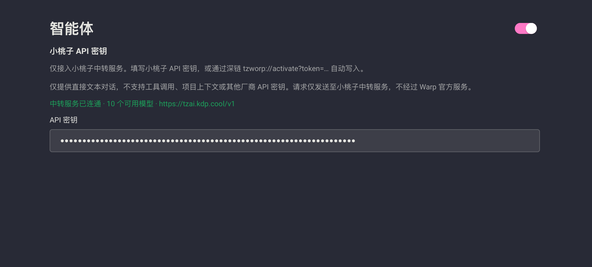

<p align="center">
  
</p>

<h1 align="center">tzWarp</h1>

<p align="center">
  <b>A Chinese terminal that talks back.</b><br>
  Use it like a normal shell. When you get stuck, ask. Commands show up as a card — they run only after you click.
</p>

<p align="center">
  <b>English</b> · <a href="README.zh-CN.md">简体中文</a>
</p>

<p align="center">
  <a href="https://github.com/kedoupi/tzWarp/releases/latest"></a>
</p>

<p align="center">
  
  
  
</p>

<p align="center">
  <a href="#get-running-in-three-minutes">Get started</a> ·
  <a href="#3-register-xiaotaozi-key">Register</a> ·
  <a href="#walk-through-it-once">Tutorial</a> ·
  <a href="#faq">FAQ</a>
</p>

---

tzWarp is a daily-driver GPU terminal (completions, splits, block select, themes) with a Chinese agent on top. The agent talks only to your **Xiaotaozi** (小桃子) relay. No Warp account. Nothing is sent to Warp Cloud.

It is for people who do not want a Warp login, already have (or will get) a Xiaotaozi key, and want **ask → see the command → confirm**.

## Get running in three minutes

### 1. Download

From [Releases](https://github.com/kedoupi/tzWarp/releases/latest):

- [tzWarp-1.0.0-macos-arm64.dmg](https://github.com/kedoupi/tzWarp/releases/download/v1.0.0/tzWarp-1.0.0-macos-arm64.dmg) (recommended)
- or [tzWarp-1.0.0-macos-arm64.zip](https://github.com/kedoupi/tzWarp/releases/download/v1.0.0/tzWarp-1.0.0-macos-arm64.zip)

**macOS 12+ / Apple Silicon** only for now. Intel Mac, Windows, and Linux: [build from source](#build-from-source).

### 2. Install

1. Open the DMG and drag **tzWarp** into **Applications**
2. First launch: in Finder or Launchpad, **right-click tzWarp → Open**  
   (the build is not Apple-notarized; a double-click may be blocked)
3. Confirm **Open** in the system dialog

tzWarp can sit next to official Warp. Data directories are separate.

### 3. Register (Xiaotaozi key)

There is **no Warp login**. Open **Settings → Agent** — this is the field:

<p align="center">
  
</p>

Then:

1. Open [Xiaotaozi](https://tzai.kdp.cool) and **create an account**
2. Copy the API key from the console
3. Paste it into the **API key** box above and press Enter
4. When the line turns green — “relay connected · N models” — you are in

Admins can also send an activate link:

```text
tzworp://activate?token=your-key
```

## Walk through it once

**1. Use it as a terminal for 30 seconds**  
`cd` into a project, run `ls` and `git status`. Completions and splits work as usual.

**2. Ask the agent about the repo**  
In tzWarp’s input (not a raw zsh prompt):

```text
/plan what is this project?
```

That opens the agent panel and streams an answer. Do not type `/plan` at a zsh prompt — zsh will treat it as a path.

**3. Commands wait for you**  
If the agent wants to `ls` or `cat` a file, you get a confirm card. Read it, then click. Output comes back into the same thread.

**4. Keep going**  
“Summarize that.” “Make the README install steps complete.” The same conversation already has the files it just read.

**5. Pick a model (optional)**  
The selector at the top of the agent is the Xiaotaozi model list. Choose one your key can use.

That is the whole loop: download → install → register → first useful turn.

## What it is for

| You want | tzWarp does |
|---|---|
| A real daily terminal | Warp-class GPU terminal |
| Ask about a repo | `/plan` or type in the agent |
| No surprise shell commands | Confirm card first |
| Multi-turn follow-up | Same thread keeps context and command output |
| Your own models | Xiaotaozi relay only — never Warp Server |
| Keep official Warp | They coexist |

## FAQ

**It will not open on double-click.**  
Right-click → Open, then allow it in the dialog.

**The agent says there is no key / no models.**  
Create an account at [Xiaotaozi](https://tzai.kdp.cool), copy the key, and paste it into **Settings → Agent**. If the box is empty, paste it again.

**`/plan` becomes `zsh: no such file or directory`.**  
It went to the shell. Type `/plan …` in tzWarp’s own input box.

**The agent repeats the same phrase.**  
1.0.0 stops that loop after confirm-run. Start a **new** conversation; do not continue a thread that already garbled.

**Does this talk to Warp?**  
No. Traffic goes to `https://tzai.kdp.cool/v1` (override with `TEAM_RELAY_BASE_URL` if you must).

**How is this different from official Warp?**  
The terminal is the open-source Warp client. There is no Warp login, Drive, Cloud Agent, or cloud handoff. The agent is relay chat plus confirm-run, not full official Oz.

## Build from source

```bash
./script/bootstrap --skip-common-skills   # first time
export TZAI_API_KEY='your-key'
./script/run-tzworp
```

Build the installer:

```bash
./script/package-tzworp
```

Ingesting official Warp updates: [docs/UPSTREAM.md](docs/UPSTREAM.md). Upstream Warp README: [README.upstream.md](README.upstream.md).

## License

Based on [Warp](https://github.com/warpdotdev/Warp), **AGPL-3.0** (parts of the UI stack are MIT). Downstream distributions must provide corresponding source.

tzWarp is not an official Warp product and is not endorsed by Denver Technologies, Inc.
